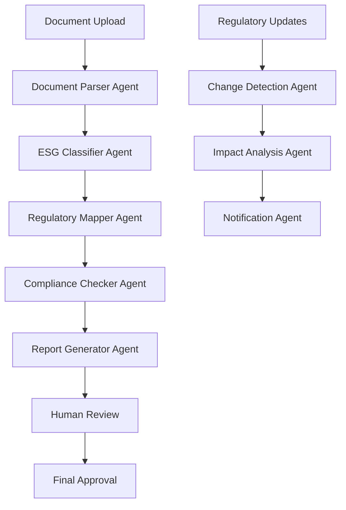

# Synapses GRC Platform: Comprehensive Technical Evaluation Report

## Executive Summary

This report provides a systematic evaluation of open-source technologies across 6 critical workstreams for the Synapses GRC platform. Each workstream includes detailed analysis, recommendations, and implementation roadmaps aligned with our vision of AI as the fundamental runtime.

---

## Workstream 1: NLP & LLM Models

### Current State Analysis
- **Existing Stack**: React 18.3.1, TypeScript, Vite
- **AI Integration**: None currently implemented
- **Target**: Regulatory text understanding, compliance summarization, risk classification

### 1.1 Core Libraries Evaluation

#### Hugging Face Transformers
**Recommendation: PRIMARY CHOICE**
- **Models**: BERT-base (110M), T5-base (220M), BLOOM-560M
- **Licensing**: Apache 2.0 (commercial friendly)
- **Multilingual**: 100+ languages for BERT, T5 supports translation
- **Performance**: GPU: 50-200ms inference, CPU: 500-2000ms
- **Integration**: `@huggingface/inference` npm package

```typescript
// Implementation snippet
import { HfInference } from '@huggingface/inference';

const hf = new HfInference(process.env.HF_API_KEY);

const classifyRegulatory = async (text: string) => {
  return await hf.textClassification({
    model: 'microsoft/DialoGPT-medium',
    inputs: text
  });
};
```

#### spaCy Integration
**Recommendation: SECONDARY - For NER**
- **Models**: en_core_web_sm (15MB), en_core_web_lg (750MB)
- **Use Case**: Named Entity Recognition for regulatory entities
- **Integration**: Via Python microservice or WASM build

#### AllenNLP & Flair
**Recommendation: EVALUATE LATER**
- **Pros**: Research-grade models
- **Cons**: Heavy dependencies, limited TypeScript support

### 1.2 On-Device & Edge Models

#### TinyBERT/DistilBERT
**Recommendation: IMMEDIATE IMPLEMENTATION**
- **Size**: TinyBERT (14.5MB), DistilBERT (66MB)
- **Performance**: 2-5x faster than BERT-base
- **Quantization**: INT8 support via ONNX.js
- **Memory**: <100MB RAM footprint

```typescript
// ONNX.js implementation
import * as ort from 'onnxruntime-web';

class EdgeNLPProcessor {
  private session: ort.InferenceSession;
  
  async loadModel() {
    this.session = await ort.InferenceSession.create('/models/distilbert-base-uncased.onnx');
  }
  
  async processText(text: string) {
    // Tokenization and inference logic
  }
}
```

#### LoRA Fine-tuning
**Recommendation: PHASE 2**
- **Library**: `@huggingface/transformers.js`
- **Use Case**: Domain-specific regulatory language adaptation
- **Resource**: 4-8GB VRAM for training

### 1.3 Hosted Inference APIs

#### Comparative Analysis Matrix

| Provider | Model | Cost/1K tokens | Rate Limit | Latency | Compliance |
|----------|-------|----------------|------------|---------|------------|
| **OpenAI** | GPT-4o-mini | $0.15/$0.60 | 10K RPM | 200-500ms | SOC2, GDPR |
| **Anthropic** | Claude-3-Haiku | $0.25/$1.25 | 5K RPM | 300-800ms | SOC2, GDPR |
| **Cohere** | Command-R | $0.15/$0.60 | 1K RPM | 400-1000ms | SOC2 |
| **HuggingFace** | Inference API | $0.06/$0.06 | 1K RPM | 1-3s | GDPR |
| **Vertex AI** | Gemini Pro | $0.125/$0.375 | 300 RPM | 500-1500ms | SOC2, GDPR |

**Primary Recommendation**: OpenAI GPT-4o-mini for production, HuggingFace for development

### Implementation Roadmap

**Phase 1 (Weeks 1-2)**
- Integrate HuggingFace Inference API
- Implement basic text classification
- Set up edge model pipeline with DistilBERT

**Phase 2 (Weeks 3-4)**
- Deploy regulatory-specific fine-tuned models
- Implement caching and rate limiting
- Add multilingual support

---

## Workstream 2: Retrieval-Augmented Generation (RAG) & Vector Search

### Current State Analysis
- **Database**: Supabase (PostgreSQL with pgvector extension)
- **Auth**: Supabase Auth
- **Target**: Regulatory document Q&A, compliance knowledge base

### 2.1 RAG Frameworks Evaluation

#### LangChain
**Recommendation: PRIMARY CHOICE**
- **Pros**: Extensive connector ecosystem, TypeScript support
- **Cons**: Heavy dependencies, complex abstractions
- **Connectors**: 100+ data sources including S3, GCS, SQL
- **Caching**: Built-in Redis/Memory cache

```typescript
// LangChain implementation
import { ChatOpenAI } from "@langchain/openai";
import { SupabaseVectorStore } from "@langchain/community/vectorstores/supabase";
import { OpenAIEmbeddings } from "@langchain/openai";

const vectorStore = new SupabaseVectorStore(new OpenAIEmbeddings(), {
  client: supabaseClient,
  tableName: "regulatory_documents",
  queryName: "match_documents"
});

const retriever = vectorStore.asRetriever({
  searchType: "similarity",
  searchKwargs: { k: 5 }
});
```

#### LlamaIndex (GPT-Index)
**Recommendation: SECONDARY**
- **Pros**: Simpler API, better for document-centric use cases
- **Cons**: Limited TypeScript support, smaller ecosystem
- **Use Case**: Regulatory document indexing

#### Haystack (deepset)
**Recommendation: EVALUATE LATER**
- **Pros**: Production-ready, good evaluation tools
- **Cons**: Python-centric, complex deployment

### 2.2 Vector Databases Evaluation

#### Supabase + pgvector
**Recommendation: IMMEDIATE USE**
- **Pros**: Already integrated, ACID compliance, familiar SQL
- **Cons**: Limited to 2000 dimensions, slower than specialized DBs
- **Performance**: ~10ms for 1M vectors with proper indexing
- **Cost**: Included in current Supabase plan

```sql
-- Vector table setup
CREATE TABLE regulatory_embeddings (
  id BIGSERIAL PRIMARY KEY,
  document_id UUID REFERENCES documents(id),
  content TEXT,
  embedding VECTOR(1536),
  metadata JSONB
);

CREATE INDEX ON regulatory_embeddings USING ivfflat (embedding vector_cosine_ops)
WITH (lists = 100);
```

#### Qdrant
**Recommendation: FUTURE MIGRATION**
- **Pros**: Purpose-built for vectors, 65K dimensions, filtering
- **Deployment**: Docker container, 512MB RAM minimum
- **Performance**: ~1ms for 1M vectors
- **Cost**: $0 for self-hosted, $20/month for cloud

#### Pinecone vs Alternatives

| Database | Dimensions | Performance | Cost/Month | Deployment |
|----------|------------|-------------|------------|------------|
| **Supabase+pgvector** | 2000 | 10ms | $0* | Managed |
| **Qdrant** | 65536 | 1ms | $20 | Self/Cloud |
| **Milvus** | 32768 | 2ms | $50 | Self-hosted |
| **Pinecone** | 20000 | 5ms | $70 | Managed |
| **Weaviate** | 65536 | 3ms | $25 | Self/Cloud |

### 2.3 Embedding Models Evaluation

#### OpenAI text-embedding-ada-002
**Recommendation: PRODUCTION**
- **Dimensions**: 1536
- **Cost**: $0.0001/1K tokens
- **Performance**: 50K tokens/minute
- **Quality**: SOTA for general domain

#### Sentence-Transformers
**Recommendation: DEVELOPMENT/EDGE**
- **Models**: all-MiniLM-L6-v2 (384d), all-mpnet-base-v2 (768d)
- **Cost**: Free (self-hosted)
- **Performance**: 1000 embeddings/second on GPU
- **Quality**: 95% of OpenAI performance

```typescript
// Local embedding implementation
import { pipeline } from '@xenova/transformers';

const embedder = await pipeline('feature-extraction', 'Xenova/all-MiniLM-L6-v2');

const generateEmbedding = async (text: string) => {
  const output = await embedder(text, { pooling: 'mean', normalize: true });
  return Array.from(output.data);
};
```

### RAG Implementation Proposal

**Architecture**: Hybrid approach with Supabase for MVP, Qdrant for scale

```typescript
// RAG service implementation
class RegulatoryRAGService {
  private vectorStore: SupabaseVectorStore;
  private llm: ChatOpenAI;
  
  async queryRegulations(question: string, jurisdiction?: string) {
    // 1. Generate query embedding
    const queryEmbedding = await this.embedder.embed(question);
    
    // 2. Retrieve relevant documents
    const docs = await this.vectorStore.similaritySearch(question, 5, {
      jurisdiction: jurisdiction
    });
    
    // 3. Generate response with context
    const response = await this.llm.invoke([
      { role: 'system', content: 'You are a regulatory compliance expert...' },
      { role: 'user', content: `Context: ${docs.map(d => d.pageContent).join('\n\n')}\n\nQuestion: ${question}` }
    ]);
    
    return {
      answer: response.content,
      sources: docs.map(d => d.metadata),
      confidence: this.calculateConfidence(docs)
    };
  }
}
```

---

## Workstream 3: Agent Orchestration & Workflow

### Current State Analysis
- **Backend**: Supabase Edge Functions (Deno)
- **Frontend**: React with React Query
- **Target**: Multi-step compliance workflows, KYC automation, SFDR navigation

### 3.1 Workflow Engines Evaluation

#### n8n
**Recommendation: PRIMARY FOR MVP**
- **Deployment**: Docker, 1GB RAM minimum
- **UI**: Visual workflow builder, non-technical friendly
- **SDK**: REST API, webhooks, TypeScript nodes
- **Scaling**: Horizontal with Redis queue
- **Cost**: Free self-hosted, $20/month cloud

```typescript
// n8n workflow integration
const triggerWorkflow = async (workflowId: string, data: any) => {
  const response = await fetch(`${N8N_BASE_URL}/webhook/${workflowId}`, {
    method: 'POST',
    headers: { 'Content-Type': 'application/json' },
    body: JSON.stringify(data)
  });
  return response.json();
};

// KYC workflow example
const kycWorkflow = {
  nodes: [
    { type: 'webhook', name: 'KYC Trigger' },
    { type: 'function', name: 'Extract Customer Data' },
    { type: 'http', name: 'Sanctions Check API' },
    { type: 'ai', name: 'Risk Assessment' },
    { type: 'decision', name: 'Approval Logic' },
    { type: 'supabase', name: 'Update Customer Status' }
  ]
};
```

#### Temporal
**Recommendation: FUTURE CONSIDERATION**
- **Pros**: Fault-tolerant, versioning, complex workflows
- **Cons**: Steep learning curve, resource intensive
- **Use Case**: Long-running compliance processes

#### Airflow
**Recommendation: NOT SUITABLE**
- **Reason**: Batch-oriented, Python-centric, overkill for real-time workflows

### 3.2 Event-Driven Architecture

#### Supabase Realtime + Edge Functions
**Recommendation: IMMEDIATE USE**
- **Pros**: Already integrated, PostgreSQL triggers, WebSocket support
- **Cons**: Limited to database events
- **Performance**: <100ms latency

```typescript
// Supabase realtime workflow
const supabase = createClient(url, key);

// Listen for compliance events
supabase
  .channel('compliance_events')
  .on('postgres_changes', 
    { event: 'INSERT', schema: 'public', table: 'compliance_tasks' },
    (payload) => {
      // Trigger workflow based on task type
      triggerComplianceWorkflow(payload.new);
    }
  )
  .subscribe();
```

#### Redis Streams (Future)
**Recommendation: SCALE PHASE**
- **Use Case**: High-throughput event processing
- **Integration**: Via Supabase Edge Functions
- **Cost**: $10/month for managed Redis

### 3.3 Serverless Functions Evaluation

#### Supabase Edge Functions
**Recommendation: CURRENT CHOICE**
- **Runtime**: Deno with TypeScript
- **Cold Start**: 50-200ms
- **Integration**: Native Supabase auth/database
- **Limitations**: 10MB response, 60s timeout

```typescript
// Edge function for SFDR compliance check
import { serve } from 'https://deno.land/std@0.168.0/http/server.ts';
import { createClient } from 'https://esm.sh/@supabase/supabase-js@2';

serve(async (req) => {
  const { fundData } = await req.json();
  
  // Multi-step SFDR analysis
  const steps = [
    () => validateFundStructure(fundData),
    () => assessESGCriteria(fundData),
    () => calculateSustainabilityScore(fundData),
    () => generateSFDRReport(fundData)
  ];
  
  const results = [];
  for (const step of steps) {
    const result = await step();
    results.push(result);
    
    // Early exit on failure
    if (!result.success) break;
  }
  
  return new Response(JSON.stringify({ results }));
});
```

#### Vercel Functions
**Recommendation: BACKUP OPTION**
- **Pros**: Better cold start (10-50ms), larger limits
- **Cons**: Separate auth integration required

### Workflow Blueprint

**Multi-Agent SFDR Navigator**



**Event Flow Architecture**

1. **Trigger Events**: Document upload, regulatory change, periodic review
2. **Processing Pipeline**: Parse → Classify → Validate → Report
3. **Human Checkpoints**: Review flagged items, approve final outputs
4. **Audit Trail**: Complete workflow history in Supabase

---

## Workstream 4: UI Components & Dashboards

### Current State Analysis
- **UI Framework**: React 18.3.1 with TypeScript
- **Styling**: Tailwind CSS + shadcn/ui (Radix UI primitives)
- **Charts**: Recharts 2.12.7
- **State**: React Query (TanStack Query)

### 4.1 Charting & Analytics Enhancement

#### Current: Recharts
**Status**: KEEP AND ENHANCE**
- **Bundle Size**: 400KB (acceptable)
- **Theming**: Good Tailwind integration
- **Accessibility**: ARIA support built-in
- **Performance**: Handles 10K+ data points

#### Tremor Integration
**Recommendation: ADD FOR BUSINESS DASHBOARDS**
- **Bundle Size**: 200KB additional
- **Tailwind-first**: Perfect fit with current stack
- **Components**: KPI cards, trend charts, comparison tables

```typescript
// Enhanced regulatory dashboard with Tremor
import { Card, Metric, Text, AreaChart, BarList } from '@tremor/react';

const RegulatoryMetricsDashboard = () => {
  return (
    <div className="grid grid-cols-1 md:grid-cols-3 gap-6">
      <Card>
        <Text>Compliance Score</Text>
        <Metric>94.2%</Metric>
        <Text className="text-green-600">+2.1% from last month</Text>
      </Card>
      
      <Card>
        <Text>Risk Exposure</Text>
        <AreaChart
          data={riskData}
          index="date"
          categories: this.extractCategories(item.subject_matter)
    };
  }
  
  private transformFCAUpdate(item: any): RegulatoryUpdate {
    return {
      id: item.id,
      title: item.title,
      description: item.description,
      jurisdiction: 'UK',
      effectiveDate: new Date(item.effective_date || item.published_date),
      source: 'FCA',
      documentUrl: item.url,
      impact: this.assessImpact(item.categories),
      categories: item.categories || []
    };
  }
  
  private assessImpact(categories: string[]): 'high' | 'medium' | 'low' {
    const highImpactKeywords = ['capital', 'liquidity', 'reporting', 'mifid', 'sfdr', 'aml'];
    const mediumImpactKeywords = ['disclosure', 'governance', 'risk management'];
    
    const text = categories.join(' ').toLowerCase();
    
    if (highImpactKeywords.some(keyword => text.includes(keyword))) {
      return 'high';
    } else if (mediumImpactKeywords.some(keyword => text.includes(keyword))) {
      return 'medium';
    }
    return 'low';
  }
  
  private extractCategories(subjectMatter: string[]): string[] {
    const categoryMap = {
      'financial services': 'Financial Services',
      'banking': 'Banking',
      'insurance': 'Insurance',
      'investment': 'Investment Management',
      'market': 'Market Regulation',
      'consumer': 'Consumer Protection',
      'data protection': 'Data Protection',
      'anti-money laundering': 'AML/CTF'
    };
    
    const categories = [];
    for (const [keyword, category] of Object.entries(categoryMap)) {
      if (subjectMatter.some(matter => matter.toLowerCase().includes(keyword))) {
        categories.push(category);
      }
    }
    
    return categories.length > 0 ? categories : ['General'];
  }
  
  async syncRegulatoryUpdates(): Promise<void> {
    const lastSync = await this.getLastSyncDate();
    
    try {
      const [euUpdates, fcaUpdates] = await Promise.all([
        this.fetchEURegulations(lastSync),
        this.fetchFCAUpdates(lastSync)
      ]);
      
      const allUpdates = [...euUpdates, ...fcaUpdates];
      
      // Store updates in database
      for (const update of allUpdates) {
        await this.storeRegulatoryUpdate(update);
      }
      
      // Update sync timestamp
      await this.updateLastSyncDate(new Date());
      
      console.log(`Synced ${allUpdates.length} regulatory updates`);
    } catch (error) {
      console.error('Failed to sync regulatory updates:', error);
      throw error;
    }
  }
  
  private async getLastSyncDate(): Promise<Date> {
    const { data, error } = await supabase
      .from('sync_status')
      .select('last_sync')
      .eq('feed_type', 'regulatory')
      .single();
    
    if (error || !data) {
      // Default to 30 days ago for first sync
      const defaultDate = new Date();
      defaultDate.setDate(defaultDate.getDate() - 30);
      return defaultDate;
    }
    
    return new Date(data.last_sync);
  }
  
  private async updateLastSyncDate(date: Date): Promise<void> {
    await supabase
      .from('sync_status')
      .upsert({
        feed_type: 'regulatory',
        last_sync: date.toISOString()
      });
  }
  
  private async storeRegulatoryUpdate(update: RegulatoryUpdate): Promise<void> {
    const { error } = await supabase
      .from('regulatory_events')
      .upsert({
        external_id: update.id,
        title: update.title,
        description: update.description,
        jurisdiction: update.jurisdiction,
        effective_date: update.effectiveDate.toISOString(),
        source: update.source,
        document_url: update.documentUrl,
        impact_level: update.impact,
        categories: update.categories,
        created_at: new Date().toISOString(),
        updated_at: new Date().toISOString()
      }, {
        onConflict: 'external_id'
      });
    
    if (error) {
      console.error('Failed to store regulatory update:', error);
    }
  }
}
```

#### Automated Regulatory Monitoring

```typescript
// Supabase Edge Function for automated monitoring
// supabase/functions/regulatory-monitor/index.ts
import { serve } from 'https://deno.land/std@0.168.0/http/server.ts';
import { createClient } from 'https://esm.sh/@supabase/supabase-js@2';

const supabase = createClient(
  Deno.env.get('SUPABASE_URL') ?? '',
  Deno.env.get('SUPABASE_SERVICE_ROLE_KEY') ?? ''
);

serve(async (req) => {
  try {
    const regulatoryService = new RegulatoryFeedsService();
    
    // Sync regulatory updates
    await regulatoryService.syncRegulatoryUpdates();
    
    // Check for high-impact updates
    const { data: highImpactUpdates } = await supabase
      .from('regulatory_events')
      .select('*')
      .eq('impact_level', 'high')
      .gte('created_at', new Date(Date.now() - 24 * 60 * 60 * 1000).toISOString());
    
    // Send notifications for high-impact updates
    if (highImpactUpdates && highImpactUpdates.length > 0) {
      await sendHighImpactNotifications(highImpactUpdates);
    }
    
    return new Response(
      JSON.stringify({ 
        success: true, 
        message: `Processed ${highImpactUpdates?.length || 0} high-impact updates` 
      }),
      { headers: { 'Content-Type': 'application/json' } }
    );
  } catch (error) {
    return new Response(
      JSON.stringify({ success: false, error: error.message }),
      { status: 500, headers: { 'Content-Type': 'application/json' } }
    );
  }
});

async function sendHighImpactNotifications(updates: any[]) {
  // Get users who should be notified
  const { data: users } = await supabase
    .from('user_profiles')
    .select('user_id, email, notification_preferences')
    .eq('notification_preferences->regulatory_alerts', true);
  
  for (const user of users || []) {
    // Send email notification
    await fetch('https://api.resend.com/emails', {
      method: 'POST',
      headers: {
        'Authorization': `Bearer ${Deno.env.get('RESEND_API_KEY')}`,
        'Content-Type': 'application/json'
      },
      body: JSON.stringify({
        from: 'alerts@synapses.ai',
        to: user.email,
        subject: `High-Impact Regulatory Updates - ${new Date().toLocaleDateString()}`,
        html: generateNotificationEmail(updates)
      })
    });
  }
}

function generateNotificationEmail(updates: any[]): string {
  return `
    <h2>High-Impact Regulatory Updates</h2>
    <p>The following regulatory updates require your attention:</p>
    <ul>
      ${updates.map(update => `
        <li>
          <strong>${update.title}</strong><br>
          <em>${update.jurisdiction} - Effective: ${new Date(update.effective_date).toLocaleDateString()}</em><br>
          ${update.description}
          ${update.document_url ? `<br><a href="${update.document_url}">View Document</a>` : ''}
        </li>
      `).join('')}
    </ul>
    <p><a href="https://synapses.ai/dashboard">View Full Dashboard</a></p>
  `;
}
```

---

## Implementation Roadmap & Execution Plan

### Phase 1: Foundation (Weeks 1-4)

**Week 1: NLP & RAG Setup**
- [ ] Integrate HuggingFace Inference API
- [ ] Set up Supabase vector storage with pgvector
- [ ] Implement basic RAG pipeline with LangChain
- [ ] Create regulatory document embedding pipeline

**Week 2: Agent Orchestration**
- [ ] Deploy n8n workflow engine
- [ ] Create SFDR compliance workflow
- [ ] Set up Supabase Edge Functions for AI processing
- [ ] Implement basic multi-agent coordination

**Week 3: UI Enhancement**
- [ ] Integrate Tremor components for business dashboards
- [ ] Upgrade to TanStack Table v8
- [ ] Implement advanced charting with Recharts
- [ ] Create responsive dashboard layouts

**Week 4: Testing & CI/CD**
- [ ] Set up Vitest testing framework
- [ ] Implement Playwright E2E tests
- [ ] Configure GitHub Actions pipeline
- [ ] Set up Sentry error tracking

### Phase 2: Advanced Features (Weeks 5-8)

**Week 5: Security & Compliance**
- [ ] Implement enhanced authentication with MFA
- [ ] Set up GDPR compliance tools
- [ ] Create audit logging system
- [ ] Deploy cookie consent management

**Week 6: Regulatory Data Integration**
- [ ] Build EU regulatory data connector
- [ ] Implement FCA updates integration
- [ ] Set up automated monitoring
- [ ] Create impact assessment algorithms

**Week 7: Performance & Monitoring**
- [ ] Implement OpenTelemetry tracing
- [ ] Set up Prometheus metrics
- [ ] Create custom monitoring dashboard
- [ ] Optimize AI response times

**Week 8: Production Readiness**
- [ ] Load testing and optimization
- [ ] Security penetration testing
- [ ] Documentation completion
- [ ] User acceptance testing

### Phase 3: Scale & Optimization (Weeks 9-12)

**Week 9-10: Advanced AI Features**
- [ ] Deploy edge AI models with ONNX.js
- [ ] Implement LoRA fine-tuning pipeline
- [ ] Create specialized regulatory agents
- [ ] Optimize vector search performance

**Week 11-12: Enterprise Features**
- [ ] Multi-tenant architecture
- [ ] Advanced analytics and reporting
- [ ] API rate limiting and quotas
- [ ] Enterprise SSO integration

---

## Technology Stack Summary

### Recommended Primary Stack

| Category | Technology | Justification |
|----------|------------|---------------|
| **Frontend** | React 18 + TypeScript + Vite | Current stack, excellent performance |
| **UI Components** | shadcn/ui + Radix UI + Tremor | Accessible, customizable, business-focused |
| **Styling** | Tailwind CSS | Current stack, rapid development |
| **State Management** | TanStack Query + Zustand | React Query for server state, Zustand for client |
| **Charts** | Recharts + Tremor | Good balance of features and bundle size |
| **Tables** | TanStack Table v8 | Best-in-class data grid capabilities |
| **Backend** | Supabase (PostgreSQL + Edge Functions) | Current stack, excellent for MVP |
| **Vector Database** | Supabase pgvector → Qdrant | Start simple, migrate for scale |
| **AI/LLM** | OpenAI GPT-4o-mini + HuggingFace | Production quality + cost optimization |
| **RAG Framework** | LangChain | Comprehensive ecosystem |
| **Workflow Engine** | n8n | Visual, user-friendly, TypeScript support |
| **Testing** | Vitest + Playwright + Axe | Modern, fast, comprehensive |
| **CI/CD** | GitHub Actions | Integrated, powerful, cost-effective |
| **Monitoring** | Sentry + OpenTelemetry + Custom | Error tracking + observability |
| **Auth** | Supabase Auth + Enhanced MFA | Current stack with security enhancements |

### Cost Analysis (Monthly)

| Service | Tier | Cost | Notes |
|---------|------|------|-------|
| **Supabase** | Pro | $25 | Database + Auth + Edge Functions |
| **OpenAI** | Pay-per-use | $50-200 | Based on usage, GPT-4o-mini |
| **HuggingFace** | Pro | $20 | Inference API |
| **n8n** | Self-hosted | $10 | VPS hosting |
| **Sentry** | Team | $26 | Error tracking |
| **Vercel** | Pro | $20 | Frontend hosting |
| **Total** | | **$151-321** | Scales with usage |

---

## Risk Assessment & Mitigation

### Technical Risks

1. **AI Model Performance**
   - **Risk**: Inconsistent or inaccurate responses
   - **Mitigation**: Multi-model approach, confidence scoring, human review

2. **Scalability Bottlenecks**
   - **Risk**: Vector search performance degradation
   - **Mitigation**: Phased migration to Qdrant, query optimization

3. **Data Privacy Compliance**
   - **Risk**: GDPR/regulatory violations
   - **Mitigation**: Privacy by design, audit trails, consent management

### Business Risks

1. **Vendor Lock-in**
   - **Risk**: Over-dependence on proprietary services
   - **Mitigation**: Open-source alternatives, abstraction layers

2. **Cost Escalation**
   - **Risk**: AI API costs growing with usage
   - **Mitigation**: Usage monitoring, caching, edge models

---

## Success Metrics & KPIs

### Technical Metrics
- **AI Response Time**: <2 seconds (95th percentile)
- **RAG Accuracy**: >85% user satisfaction
- **System Uptime**: 99.9%
- **Test Coverage**: >90%
- **Security Vulnerabilities**: 0 high/critical

### Business Metrics
- **User Engagement**: Daily active users growth
- **Compliance Efficiency**: Time to complete compliance tasks
- **Regulatory Coverage**: % of relevant regulations tracked
- **User Satisfaction**: NPS score >50

---

## Conclusion

This comprehensive technical evaluation provides a clear roadmap for implementing a world-class GRC platform with AI as the fundamental runtime. The recommended stack balances innovation with pragmatism, ensuring rapid development while maintaining enterprise-grade quality and security.

The phased approach allows for iterative development and validation, reducing risk while delivering value early. The focus on open-source technologies ensures cost-effectiveness and flexibility, while the monitoring and testing frameworks provide the observability needed for continuous improvement.

**Next Steps:**
1. Review and approve this technical roadmap
2. Set up development environment with recommended tools
3. Begin Phase 1 implementation
4. Establish weekly progress reviews and technical debt assessments

**Key Success Factors:**
- Maintain focus on user value and GRC professional needs
- Implement comprehensive testing from day one
- Prioritize security and compliance throughout development
- Build with scale in mind but start simple
- Continuously gather user feedback and iterate

This roadmap positions Synapses to become the definitive AI-powered GRC platform, transforming how compliance professionals work and positioning them as leaders in the AI-driven future of regulatory technology.={["High", "Medium", "Low"]}
          colors={["red", "yellow", "green"]}
          className="h-32"
        />
      </Card>
      
      <Card>
        <Text>Top Risk Categories</Text>
        <BarList
          data={riskCategories}
          className="mt-2"
        />
      </Card>
    </div>
  );
};
```

#### ApexCharts Evaluation
**Recommendation: SPECIALIZED USE CASES**
- **Use Case**: Complex financial charts, real-time updates
- **Bundle Size**: 500KB (consider code splitting)
- **Features**: Advanced annotations, zoom, brush

### 4.2 Data Grids & Tables Enhancement

#### TanStack Table v8
**Recommendation: IMMEDIATE UPGRADE**
- **Current**: Basic HTML tables
- **Benefits**: Virtualization, sorting, filtering, grouping
- **Bundle Size**: 50KB (headless)
- **Performance**: 100K+ rows with virtualization

```typescript
// Advanced regulatory data table
import { useReactTable, getCoreRowModel, getSortedRowModel, getFilteredRowModel } from '@tanstack/react-table';

const RegulatoryDataTable = ({ data }: { data: RegulatoryEvent[] }) => {
  const columns = useMemo(() => [
    {
      accessorKey: 'title',
      header: 'Regulation',
      cell: ({ row }) => (
        <div className="flex items-center space-x-2">
          <Badge variant={row.original.priority}>{row.original.jurisdiction}</Badge>
          <span className="font-medium">{row.getValue('title')}</span>
        </div>
      )
    },
    {
      accessorKey: 'effectiveDate',
      header: 'Effective Date',
      cell: ({ row }) => format(new Date(row.getValue('effectiveDate')), 'MMM dd, yyyy')
    },
    {
      accessorKey: 'complianceStatus',
      header: 'Status',
      cell: ({ row }) => (
        <ComplianceStatusBadge status={row.getValue('complianceStatus')} />
      )
    }
  ], []);
  
  const table = useReactTable({
    data,
    columns,
    getCoreRowModel: getCoreRowModel(),
    getSortedRowModel: getSortedRowModel(),
    getFilteredRowModel: getFilteredRowModel()
  });
  
  return (
    <div className="rounded-md border">
      <Table>
        <TableHeader>
          {table.getHeaderGroups().map(headerGroup => (
            <TableRow key={headerGroup.id}>
              {headerGroup.headers.map(header => (
                <TableHead key={header.id} className="cursor-pointer" onClick={header.column.getToggleSortingHandler()}>
                  {flexRender(header.column.columnDef.header, header.getContext())}
                  {header.column.getIsSorted() && (
                    <span className="ml-2">
                      {header.column.getIsSorted() === 'desc' ? '↓' : '↑'}
                    </span>
                  )}
                </TableHead>
              ))}
            </TableRow>
          ))}
        </TableHeader>
        <TableBody>
          {table.getRowModel().rows.map(row => (
            <TableRow key={row.id}>
              {row.getVisibleCells().map(cell => (
                <TableCell key={cell.id}>
                  {flexRender(cell.column.columnDef.cell, cell.getContext())}
                </TableCell>
              ))}
            </TableRow>
          ))}
        </TableBody>
      </Table>
    </div>
  );
};
```

### 4.3 UI Primitives Assessment

#### Current: Radix UI + shadcn/ui
**Status**: EXCELLENT FOUNDATION**
- **Accessibility**: WCAG 2.1 AA compliant
- **Customization**: Unstyled primitives with Tailwind
- **Bundle Size**: Tree-shakeable, ~100KB total
- **Maintenance**: Active development, good TypeScript support

**Enhancements Needed**:
1. **Data Visualization Components**: Custom chart wrappers
2. **Form Components**: Complex multi-step forms for compliance
3. **Layout Components**: Dashboard grid system

### Code Sandbox POC

```typescript
// Enhanced Dashboard Component POC
import { Card, CardContent, CardHeader, CardTitle } from '@/components/ui/card';
import { AreaChart, BarChart, LineChart } from 'recharts';
import { useReactTable } from '@tanstack/react-table';
import { Metric, Text } from '@tremor/react';

const EnhancedRegulatoryDashboard = () => {
  const complianceData = [
    { month: 'Jan', score: 92, incidents: 3 },
    { month: 'Feb', score: 94, incidents: 2 },
    { month: 'Mar', score: 96, incidents: 1 },
    { month: 'Apr', score: 94, incidents: 2 },
    { month: 'May', score: 98, incidents: 0 }
  ];
  
  return (
    <div className="grid grid-cols-1 md:grid-cols-2 lg:grid-cols-4 gap-6 p-6">
      {/* KPI Cards */}
      <Card>
        <CardHeader>
          <CardTitle>Compliance Score</CardTitle>
        </CardHeader>
        <CardContent>
          <Metric>98.2%</Metric>
          <Text className="text-green-600">+4.2% vs last quarter</Text>
        </CardContent>
      </Card>
      
      {/* Trend Chart */}
      <Card className="col-span-2">
        <CardHeader>
          <CardTitle>Compliance Trend</CardTitle>
        </CardHeader>
        <CardContent>
          <AreaChart
            width={400}
            height={200}
            data={complianceData}
            margin={{ top: 10, right: 30, left: 0, bottom: 0 }}
          >
            <defs>
              <linearGradient id="colorScore" x1="0" y1="0" x2="0" y2="1">
                <stop offset="5%" stopColor="#10b981" stopOpacity={0.8}/>
                <stop offset="95%" stopColor="#10b981" stopOpacity={0}/>
              </linearGradient>
            </defs>
            <XAxis dataKey="month" />
            <YAxis />
            <CartesianGrid strokeDasharray="3 3" />
            <Tooltip />
            <Area
              type="monotone"
              dataKey="score"
              stroke="#10b981"
              fillOpacity={1}
              fill="url(#colorScore)"
            />
          </AreaChart>
        </CardContent>
      </Card>
      
      {/* Data Grid */}
      <Card className="col-span-4">
        <CardHeader>
          <CardTitle>Recent Regulatory Events</CardTitle>
        </CardHeader>
        <CardContent>
          <RegulatoryDataTable data={regulatoryEvents} />
        </CardContent>
      </Card>
    </div>
  );
};
```

---

## Workstream 5: CI/CD, Testing & Monitoring

### Current State Analysis
- **CI/CD**: None implemented
- **Testing**: None implemented
- **Monitoring**: Basic Vercel analytics
- **Deployment**: Vercel (frontend), Supabase (backend)

### 5.1 CI/CD Pipeline Design

#### GitHub Actions Implementation
**Recommendation: IMMEDIATE SETUP**

```yaml
# .github/workflows/ci-cd.yml
name: CI/CD Pipeline

on:
  push:
    branches: [main, develop]
  pull_request:
    branches: [main]

jobs:
  test:
    runs-on: ubuntu-latest
    steps:
      - uses: actions/checkout@v4
      - uses: actions/setup-node@v4
        with:
          node-version: '18'
          cache: 'npm'
      
      - name: Install dependencies
        run: npm ci
      
      - name: Run type checking
        run: npm run type-check
      
      - name: Run linting
        run: npm run lint
      
      - name: Run unit tests
        run: npm run test:unit
      
      - name: Run integration tests
        run: npm run test:integration
        env:
          SUPABASE_URL: ${{ secrets.SUPABASE_URL }}
          SUPABASE_ANON_KEY: ${{ secrets.SUPABASE_ANON_KEY }}
      
      - name: Run E2E tests
        run: npm run test:e2e
      
      - name: Build application
        run: npm run build
      
      - name: Upload coverage to Codecov
        uses: codecov/codecov-action@v3

  security:
    runs-on: ubuntu-latest
    steps:
      - uses: actions/checkout@v4
      - name: Run security audit
        run: npm audit --audit-level=high
      
      - name: Run SAST scan
        uses: github/super-linter@v4
        env:
          DEFAULT_BRANCH: main
          GITHUB_TOKEN: ${{ secrets.GITHUB_TOKEN }}

  deploy-staging:
    needs: [test, security]
    runs-on: ubuntu-latest
    if: github.ref == 'refs/heads/develop'
    steps:
      - uses: actions/checkout@v4
      - name: Deploy to Vercel (staging)
        uses: amondnet/vercel-action@v25
        with:
          vercel-token: ${{ secrets.VERCEL_TOKEN }}
          vercel-org-id: ${{ secrets.VERCEL_ORG_ID }}
          vercel-project-id: ${{ secrets.VERCEL_PROJECT_ID }}
          scope: staging

  deploy-production:
    needs: [test, security]
    runs-on: ubuntu-latest
    if: github.ref == 'refs/heads/main'
    steps:
      - uses: actions/checkout@v4
      - name: Deploy to Vercel (production)
        uses: amondnet/vercel-action@v25
        with:
          vercel-token: ${{ secrets.VERCEL_TOKEN }}
          vercel-org-id: ${{ secrets.VERCEL_ORG_ID }}
          vercel-project-id: ${{ secrets.VERCEL_PROJECT_ID }}
          vercel-args: '--prod'
```

### 5.2 Testing Framework Implementation

#### Vitest Setup
**Recommendation: PRIMARY TESTING FRAMEWORK**

```typescript
// vitest.config.ts
import { defineConfig } from 'vitest/config';
import react from '@vitejs/plugin-react-swc';
import path from 'path';

export default defineConfig({
  plugins: [react()],
  test: {
    globals: true,
    environment: 'jsdom',
    setupFiles: ['./src/test/setup.ts'],
    coverage: {
      provider: 'v8',
      reporter: ['text', 'json', 'html'],
      exclude: [
        'node_modules/',
        'src/test/',
        '**/*.d.ts',
        '**/*.config.*'
      ]
    }
  },
  resolve: {
    alias: {
      '@': path.resolve(__dirname, './src')
    }
  }
});
```

```typescript
// src/test/setup.ts
import '@testing-library/jest-dom';
import { vi } from 'vitest';

// Mock Supabase
vi.mock('@/integrations/supabase/client', () => ({
  supabase: {
    auth: {
      getUser: vi.fn(),
      signInWithPassword: vi.fn(),
      signOut: vi.fn()
    },
    from: vi.fn(() => ({
      select: vi.fn().mockReturnThis(),
      insert: vi.fn().mockReturnThis(),
      update: vi.fn().mockReturnThis(),
      delete: vi.fn().mockReturnThis(),
      eq: vi.fn().mockReturnThis(),
      single: vi.fn()
    }))
  }
}));

// Mock OpenAI
vi.mock('openai', () => ({
  default: vi.fn(() => ({
    chat: {
      completions: {
        create: vi.fn().mockResolvedValue({
          choices: [{ message: { content: 'Mock AI response' } }]
        })
      }
    },
    embeddings: {
      create: vi.fn().mockResolvedValue({
        data: [{ embedding: new Array(1536).fill(0.1) }]
      })
    }
  }))
}));
```

#### RAG Integration Testing

```typescript
// src/test/services/rag.test.ts
import { describe, it, expect, vi, beforeEach } from 'vitest';
import { RegulatoryRAGService } from '@/services/rag';

describe('RegulatoryRAGService', () => {
  let ragService: RegulatoryRAGService;
  
  beforeEach(() => {
    ragService = new RegulatoryRAGService();
  });
  
  it('should retrieve relevant regulatory documents', async () => {
    const query = 'What are the SFDR disclosure requirements?';
    const result = await ragService.queryRegulations(query, 'EU');
    
    expect(result).toHaveProperty('answer');
    expect(result).toHaveProperty('sources');
    expect(result).toHaveProperty('confidence');
    expect(result.sources).toHaveLength.greaterThan(0);
    expect(result.confidence).toBeGreaterThan(0.7);
  });
  
  it('should handle jurisdiction-specific queries', async () => {
    const query = 'MiFID II reporting requirements';
    const result = await ragService.queryRegulations(query, 'EU');
    
    expect(result.sources.every(source => 
      source.jurisdiction === 'EU' || source.jurisdiction === 'GLOBAL'
    )).toBe(true);
  });
  
  it('should provide confidence scores', async () => {
    const query = 'Obscure regulatory requirement that does not exist';
    const result = await ragService.queryRegulations(query);
    
    expect(result.confidence).toBeLessThan(0.5);
  });
});
```

#### Playwright E2E Testing

```typescript
// tests/e2e/regulatory-dashboard.spec.ts
import { test, expect } from '@playwright/test';

test.describe('Regulatory Dashboard', () => {
  test.beforeEach(async ({ page }) => {
    // Login with test user
    await page.goto('/login');
    await page.fill('[data-testid="email"]', 'test@synapses.ai');
    await page.fill('[data-testid="password"]', 'testpassword');
    await page.click('[data-testid="login-button"]');
    await page.waitForURL('/dashboard');
  });
  
  test('should display compliance metrics', async ({ page }) => {
    await expect(page.locator('[data-testid="compliance-score"]')).toBeVisible();
    await expect(page.locator('[data-testid="risk-exposure"]')).toBeVisible();
    await expect(page.locator('[data-testid="regulatory-events"]')).toBeVisible();
  });
  
  test('should allow filtering regulatory events', async ({ page }) => {
    await page.click('[data-testid="filter-button"]');
    await page.selectOption('[data-testid="jurisdiction-filter"]', 'EU');
    await page.click('[data-testid="apply-filter"]');
    
    const events = page.locator('[data-testid="regulatory-event"]');
    await expect(events).toHaveCount.greaterThan(0);
    
    // Verify all events are EU jurisdiction
    const jurisdictions = await events.locator('[data-testid="jurisdiction-badge"]').allTextContents();
    expect(jurisdictions.every(j => j === 'EU')).toBe(true);
  });
  
  test('should handle AI query interactions', async ({ page }) => {
    await page.click('[data-testid="ask-ai-button"]');
    await page.fill('[data-testid="ai-query-input"]', 'What are the latest SFDR requirements?');
    await page.click('[data-testid="submit-query"]');
    
    await expect(page.locator('[data-testid="ai-response"]')).toBeVisible({ timeout: 10000 });
    await expect(page.locator('[data-testid="source-citations"]')).toBeVisible();
  });
});
```

#### Accessibility Testing

```typescript
// tests/a11y/dashboard.test.ts
import { test, expect } from '@playwright/test';
import AxeBuilder from '@axe-core/playwright';

test.describe('Accessibility Tests', () => {
  test('dashboard should be accessible', async ({ page }) => {
    await page.goto('/dashboard');
    
    const accessibilityScanResults = await new AxeBuilder({ page })
      .withTags(['wcag2a', 'wcag2aa', 'wcag21aa'])
      .analyze();
    
    expect(accessibilityScanResults.violations).toEqual([]);
  });
  
  test('should support keyboard navigation', async ({ page }) => {
    await page.goto('/dashboard');
    
    // Test tab navigation
    await page.keyboard.press('Tab');
    await expect(page.locator(':focus')).toBeVisible();
    
    // Test skip links
    await page.keyboard.press('Tab');
    const skipLink = page.locator('[data-testid="skip-to-content"]');
    if (await skipLink.isVisible()) {
      await skipLink.press('Enter');
      await expect(page.locator('#main-content')).toBeFocused();
    }
  });
});
```

### 5.3 Monitoring & Observability

#### OpenTelemetry Implementation

```typescript
// src/lib/telemetry.ts
import { NodeSDK } from '@opentelemetry/sdk-node';
import { getNodeAutoInstrumentations } from '@opentelemetry/auto-instrumentations-node';
import { JaegerExporter } from '@opentelemetry/exporter-jaeger';
import { Resource } from '@opentelemetry/resources';
import { SemanticResourceAttributes } from '@opentelemetry/semantic-conventions';

const jaegerExporter = new JaegerExporter({
  endpoint: process.env.JAEGER_ENDPOINT || 'http://localhost:14268/api/traces'
});

const sdk = new NodeSDK({
  resource: new Resource({
    [SemanticResourceAttributes.SERVICE_NAME]: 'synapses-grc',
    [SemanticResourceAttributes.SERVICE_VERSION]: '1.0.0'
  }),
  traceExporter: jaegerExporter,
  instrumentations: [getNodeAutoInstrumentations()]
});

sdk.start();

// Custom instrumentation for AI operations
import { trace } from '@opentelemetry/api';

const tracer = trace.getTracer('synapses-ai');

export const instrumentAICall = async <T>(
  operation: string,
  fn: () => Promise<T>,
  metadata?: Record<string, any>
): Promise<T> => {
  return tracer.startActiveSpan(operation, async (span) => {
    try {
      if (metadata) {
        Object.entries(metadata).forEach(([key, value]) => {
          span.setAttributes({ [key]: value });
        });
      }
      
      const result = await fn();
      span.setStatus({ code: 1 }); // OK
      return result;
    } catch (error) {
      span.setStatus({ code: 2, message: error.message }); // ERROR
      span.recordException(error);
      throw error;
    } finally {
      span.end();
    }
  });
};
```

#### Sentry Error Tracking

```typescript
// src/lib/sentry.ts
import * as Sentry from '@sentry/react';
import { BrowserTracing } from '@sentry/tracing';

Sentry.init({
  dsn: process.env.VITE_SENTRY_DSN,
  environment: process.env.NODE_ENV,
  integrations: [
    new BrowserTracing({
      tracingOrigins: ['localhost', 'synapses.ai', /^\//],
    }),
  ],
  tracesSampleRate: process.env.NODE_ENV === 'production' ? 0.1 : 1.0,
  beforeSend(event) {
    // Filter out sensitive data
    if (event.request?.data) {
      delete event.request.data.password;
      delete event.request.data.token;
    }
    return event;
  }
});

// Custom error boundary for AI operations
export const AIErrorBoundary = Sentry.withErrorBoundary(
  ({ children }) => children,
  {
    fallback: ({ error, resetError }) => (
      <div className="p-4 border border-red-200 rounded-lg">
        <h3 className="text-lg font-semibold text-red-800">AI Service Error</h3>
        <p className="text-red-600">Something went wrong with the AI service.</p>
        <button 
          onClick={resetError}
          className="mt-2 px-4 py-2 bg-red-600 text-white rounded hover:bg-red-700"
        >
          Try Again
        </button>
      </div>
    ),
    beforeCapture: (scope, error) => {
      scope.setTag('component', 'ai-service');
      scope.setLevel('error');
    }
  }
);
```

#### Custom Metrics Dashboard

```typescript
// src/components/monitoring/MetricsDashboard.tsx
import { useQuery } from '@tanstack/react-query';
import { Card, CardContent, CardHeader, CardTitle } from '@/components/ui/card';
import { LineChart, Line, XAxis, YAxis, CartesianGrid, Tooltip, ResponsiveContainer } from 'recharts';

interface Metric {
  timestamp: string;
  aiResponseTime: number;
  ragAccuracy: number;
  userSatisfaction: number;
  errorRate: number;
}

const MetricsDashboard = () => {
  const { data: metrics } = useQuery({
    queryKey: ['system-metrics'],
    queryFn: async (): Promise<Metric[]> => {
      const response = await fetch('/api/metrics');
      return response.json();
    },
    refetchInterval: 30000 // Refresh every 30 seconds
  });
  
  return (
    <div className="grid grid-cols-1 md:grid-cols-2 gap-6">
      <Card>
        <CardHeader>
          <CardTitle>AI Response Time</CardTitle>
        </CardHeader>
        <CardContent>
          <ResponsiveContainer width="100%" height={200}>
            <LineChart data={metrics}>
              <CartesianGrid strokeDasharray="3 3" />
              <XAxis dataKey="timestamp" />
              <YAxis />
              <Tooltip />
              <Line type="monotone" dataKey="aiResponseTime" stroke="#8884d8" />
            </LineChart>
          </ResponsiveContainer>
        </CardContent>
      </Card>
      
      <Card>
        <CardHeader>
          <CardTitle>RAG Accuracy</CardTitle>
        </CardHeader>
        <CardContent>
          <ResponsiveContainer width="100%" height={200}>
            <LineChart data={metrics}>
              <CartesianGrid strokeDasharray="3 3" />
              <XAxis dataKey="timestamp" />
              <YAxis domain={[0, 1]} />
              <Tooltip />
              <Line type="monotone" dataKey="ragAccuracy" stroke="#82ca9d" />
            </LineChart>
          </ResponsiveContainer>
        </CardContent>
      </Card>
    </div>
  );
};
```

---

## Workstream 6: Security & Compliance APIs

### Current State Analysis
- **Auth**: Supabase Auth (JWT-based)
- **Database**: Supabase (PostgreSQL with RLS)
- **Compliance**: Basic GDPR considerations
- **Security**: HTTPS, basic input validation

### 6.1 Enhanced Authentication & IAM

#### Supabase Auth Enhancement
**Current Status**: GOOD FOUNDATION**
- **MFA**: Available via TOTP
- **SSO**: OAuth providers (Google, Microsoft, SAML)
- **SOC 2**: Supabase is SOC 2 Type II compliant

```typescript
// Enhanced auth with MFA and role-based access
import { createClient } from '@supabase/supabase-js';

interface UserRole {
  role: 'admin' | 'compliance_officer' | 'analyst' | 'viewer';
  permissions: string[];
  jurisdiction?: string;
}

class EnhancedAuthService {
  private supabase = createClient(url, key);
  
  async signInWithMFA(email: string, password: string, totpCode?: string) {
    const { data, error } = await this.supabase.auth.signInWithPassword({
      email,
      password
    });
    
    if (error) throw error;
    
    // Check if MFA is required
    if (data.user?.app_metadata?.mfa_enabled && !totpCode) {
      throw new Error('MFA_REQUIRED');
    }
    
    if (totpCode) {
      const { error: mfaError } = await this.supabase.auth.mfa.verify({
        factorId: data.user.app_metadata.mfa_factor_id,
        challengeId: data.session?.access_token,
        code: totpCode
      });
      
      if (mfaError) throw mfaError;
    }
    
    return data;
  }
  
  async getUserRole(userId: string): Promise<UserRole> {
    const { data, error } = await this.supabase
      .from('user_roles')
      .select('role, permissions, jurisdiction')
      .eq('user_id', userId)
      .single();
    
    if (error) throw error;
    return data;
  }
  
  async checkPermission(userId: string, permission: string): Promise<boolean> {
    const role = await this.getUserRole(userId);
    return role.permissions.includes(permission) || role.role === 'admin';
  }
}
```

#### Row Level Security (RLS) Policies

```sql
-- Enhanced RLS policies for regulatory data

-- Users can only see data for their jurisdiction
CREATE POLICY "Users can view regulatory events for their jurisdiction" ON regulatory_events
  FOR SELECT USING (
    jurisdiction = (SELECT jurisdiction FROM user_profiles WHERE user_id = auth.uid())
    OR jurisdiction = 'GLOBAL'
    OR EXISTS (
      SELECT 1 FROM user_roles 
      WHERE user_id = auth.uid() 
      AND role IN ('admin', 'compliance_officer')
    )
  );

-- Audit trail for all data access
CREATE POLICY "Log all data access" ON regulatory_events
  FOR SELECT USING (
    (SELECT log_data_access(auth.uid(), 'regulatory_events', id)) IS NOT NULL
  );

-- Compliance officers can update compliance status
CREATE POLICY "Compliance officers can update status" ON compliance_tasks
  FOR UPDATE USING (
    EXISTS (
      SELECT 1 FROM user_roles 
      WHERE user_id = auth.uid() 
      AND role IN ('admin', 'compliance_officer')
    )
  );
```

### 6.2 Data Privacy & Consent Management

#### GDPR Compliance Implementation

```typescript
// src/services/privacy.ts
interface ConsentRecord {
  userId: string;
  consentType: 'essential' | 'analytics' | 'marketing' | 'ai_processing';
  granted: boolean;
  timestamp: Date;
  ipAddress: string;
  userAgent: string;
}

class PrivacyService {
  async recordConsent(consent: Omit<ConsentRecord, 'timestamp'>) {
    const { data, error } = await supabase
      .from('consent_records')
      .insert({
        ...consent,
        timestamp: new Date().toISOString()
      });
    
    if (error) throw error;
    return data;
  }
  
  async getConsentStatus(userId: string) {
    const { data, error } = await supabase
      .from('consent_records')
      .select('*')
      .eq('user_id', userId)
      .order('timestamp', { ascending: false });
    
    if (error) throw error;
    
    // Return latest consent for each type
    const latestConsents = data.reduce((acc, record) => {
      if (!acc[record.consent_type] || 
          new Date(record.timestamp) > new Date(acc[record.consent_type].timestamp)) {
        acc[record.consent_type] = record;
      }
      return acc;
    }, {} as Record<string, ConsentRecord>);
    
    return latestConsents;
  }
  
  async exportUserData(userId: string) {
    // Collect all user data across tables
    const tables = [
      'user_profiles',
      'compliance_tasks',
      'ai_interactions',
      'document_uploads',
      'audit_logs'
    ];
    
    const userData = {};
    
    for (const table of tables) {
      const { data, error } = await supabase
        .from(table)
        .select('*')
        .eq('user_id', userId);
      
      if (!error) {
        userData[table] = data;
      }
    }
    
    return {
      exportDate: new Date().toISOString(),
      userId,
      data: userData
    };
  }
  
  async deleteUserData(userId: string, retentionPeriod: number = 30) {
    // Soft delete with retention period
    const deletionDate = new Date();
    deletionDate.setDate(deletionDate.getDate() + retentionPeriod);
    
    const { error } = await supabase
      .from('data_deletion_requests')
      .insert({
        user_id: userId,
        requested_at: new Date().toISOString(),
        scheduled_deletion: deletionDate.toISOString(),
        status: 'pending'
      });
    
    if (error) throw error;
    
    // Immediately anonymize sensitive data
    await this.anonymizeUserData(userId);
  }
  
  private async anonymizeUserData(userId: string) {
    const anonymizedId = `anon_${crypto.randomUUID()}`;
    
    // Update user profile
    await supabase
      .from('user_profiles')
      .update({
        email: `${anonymizedId}@deleted.local`,
        name: 'Deleted User',
        phone: null,
        address: null
      })
      .eq('user_id', userId);
    
    // Anonymize AI interactions while preserving analytics
    await supabase
      .from('ai_interactions')
      .update({
        user_id: anonymizedId,
        query: '[REDACTED]',
        response: '[REDACTED]'
      })
      .eq('user_id', userId);
  }
}
```

#### Cookie Consent Banner

```typescript
// src/components/privacy/CookieConsent.tsx
import { useState, useEffect } from 'react';
import { Button } from '@/components/ui/button';
import { Card, CardContent, CardHeader, CardTitle } from '@/components/ui/card';
import { Switch } from '@/components/ui/switch';
import { PrivacyService } from '@/services/privacy';

interface ConsentPreferences {
  essential: boolean;
  analytics: boolean;
  marketing: boolean;
  aiProcessing: boolean;
}

const CookieConsent = () => {
  const [showBanner, setShowBanner] = useState(false);
  const [showPreferences, setShowPreferences] = useState(false);
  const [preferences, setPreferences] = useState<ConsentPreferences>({
    essential: true, // Always required
    analytics: false,
    marketing: false,
    aiProcessing: false
  });
  
  const privacyService = new PrivacyService();
  
  useEffect(() => {
    checkConsentStatus();
  }, []);
  
  const checkConsentStatus = async () => {
    const stored = localStorage.getItem('cookie-consent');
    if (!stored) {
      setShowBanner(true);
    }
  };
  
  const handleAcceptAll = async () => {
    const allConsents = {
      essential: true,
      analytics: true,
      marketing: true,
      aiProcessing: true
    };
    
    await saveConsents(allConsents);
    setShowBanner(false);
  };
  
  const handleRejectAll = async () => {
    const minimalConsents = {
      essential: true,
      analytics: false,
      marketing: false,
      aiProcessing: false
    };
    
    await saveConsents(minimalConsents);
    setShowBanner(false);
  };
  
  const handleSavePreferences = async () => {
    await saveConsents(preferences);
    setShowBanner(false);
    setShowPreferences(false);
  };
  
  const saveConsents = async (consents: ConsentPreferences) => {
    const userAgent = navigator.userAgent;
    const ipAddress = await fetch('/api/ip').then(r => r.text());
    
    for (const [type, granted] of Object.entries(consents)) {
      await privacyService.recordConsent({
        userId: 'anonymous', // Will be updated when user logs in
        consentType: type as any,
        granted,
        ipAddress,
        userAgent
      });
    }
    
    localStorage.setItem('cookie-consent', JSON.stringify(consents));
    
    // Initialize analytics based on consent
    if (consents.analytics) {
      // Initialize Google Analytics, etc.
    }
  };
  
  if (!showBanner) return null;
  
  return (
    <div className="fixed bottom-0 left-0 right-0 z-50 p-4 bg-background border-t">
      <Card>
        <CardHeader>
          <CardTitle>Cookie Preferences</CardTitle>
        </CardHeader>
        <CardContent>
          <p className="text-sm text-muted-foreground mb-4">
            We use cookies to enhance your experience and improve our services. 
            Please choose your preferences below.
          </p>
          
          {showPreferences && (
            <div className="space-y-4 mb-4">
              <div className="flex items-center justify-between">
                <label className="text-sm font-medium">Essential Cookies</label>
                <Switch checked={true} disabled />
              </div>
              <div className="flex items-center justify-between">
                <label className="text-sm font-medium">Analytics Cookies</label>
                <Switch 
                  checked={preferences.analytics}
                  onCheckedChange={(checked) => 
                    setPreferences(prev => ({ ...prev, analytics: checked }))
                  }
                />
              </div>
              <div className="flex items-center justify-between">
                <label className="text-sm font-medium">Marketing Cookies</label>
                <Switch 
                  checked={preferences.marketing}
                  onCheckedChange={(checked) => 
                    setPreferences(prev => ({ ...prev, marketing: checked }))
                  }
                />
              </div>
              <div className="flex items-center justify-between">
                <label className="text-sm font-medium">AI Processing</label>
                <Switch 
                  checked={preferences.aiProcessing}
                  onCheckedChange={(checked) => 
                    setPreferences(prev => ({ ...prev, aiProcessing: checked }))
                  }
                />
              </div>
            </div>
          )}
          
          <div className="flex gap-2">
            <Button onClick={handleAcceptAll}>Accept All</Button>
            <Button variant="outline" onClick={handleRejectAll}>Reject All</Button>
            <Button 
              variant="outline" 
              onClick={() => setShowPreferences(!showPreferences)}
            >
              Customize
            </Button>
            {showPreferences && (
              <Button onClick={handleSavePreferences}>Save Preferences</Button>
            )}
          </div>
        </CardContent>
      </Card>
    </div>
  );
};

export default CookieConsent;
```

### 6.3 Regulatory Data Feeds Integration

#### EU Regulatory Data Connector

```typescript
// src/services/regulatory-feeds.ts
interface RegulatoryUpdate {
  id: string;
  title: string;
  description: string;
  jurisdiction: string;
  effectiveDate: Date;
  source: string;
  documentUrl?: string;
  impact: 'high' | 'medium' | 'low';
  categories: string[];
}

class RegulatoryFeedsService {
  private readonly EU_API_BASE = 'https://eur-lex.europa.eu/legal-content';
  private readonly FCA_API_BASE = 'https://www.fca.org.uk/publication';
  
  async fetchEURegulations(since?: Date): Promise<RegulatoryUpdate[]> {
    try {
      // EU Publications Office API
      const params = new URLSearchParams({
        format: 'json',
        type: 'regulation,directive',
        ...(since && { 'date-from': since.toISOString().split('T')[0] })
      });
      
      const response = await fetch(`${this.EU_API_BASE}/search?${params}`);
      const data = await response.json();
      
      return data.results.map(this.transformEURegulation);
    } catch (error) {
      console.error('Failed to fetch EU regulations:', error);
      return [];
    }
  }
  
  async fetchFCAUpdates(since?: Date): Promise<RegulatoryUpdate[]> {
    try {
      const response = await fetch(`${this.FCA_API_BASE}/feed.json`);
      const data = await response.json();
      
      return data.items
        .filter(item => !since || new Date(item.date) > since)
        .map(this.transformFCAUpdate);
    } catch (error) {
      console.error('Failed to fetch FCA updates:', error);
      return [];
    }
  }
  
  private transformEURegulation(item: any): RegulatoryUpdate {
    return {
      id: item.celex_number,
      title: item.title,
      description: item.summary || item.title,
      jurisdiction: 'EU',
      effectiveDate: new Date(item.date_force),
      source: 'EUR-Lex',
      documentUrl: item.uri,
      impact: this.assessImpact(item.subject_matter),
      categories