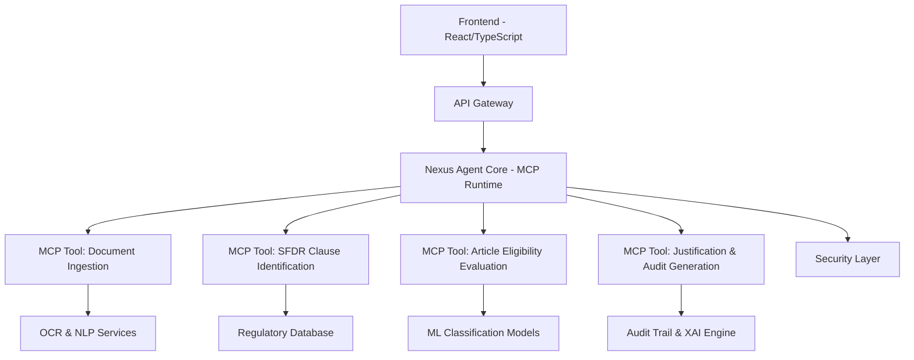

# Product Requirements Document (PRD)

# Synapses GRC Platform - Nexus Agent

**Version:** 1.0  
**Date:** August 2025  
**Document Owner:** Product Management  
**Classification:** Internal Use  
**Next Review:** Q2 2025

---

## 📋 **Document Control & Governance**

| **Attribute**                | **Details**                              |
| ---------------------------- | ---------------------------------------- |
| **Document ID**              | PRD-SYNAPSES-001                         |
| **Version**                  | 1.0                                      |
| **Status**                   | Active                                   |
| **Approval Authority**       | Product Council                          |
| **Review Cycle**             | Quarterly                                |
| **Stakeholder Distribution** | Engineering, Compliance, Legal, Security |
| **Regulatory Alignment**     | SFDR, GDPR, SOC 2 Type II                |

---

## 🎯 **Executive Summary**

### **Product Vision**

Synapses GRC Platform with Nexus Agent represents the next generation of regulatory compliance technology, delivering AI-powered governance, risk, and compliance management specifically designed for the European financial services sector. Our platform transforms complex regulatory requirements into intelligent, automated workflows that ensure continuous compliance while reducing operational overhead.

### **Strategic Objectives**

- **Regulatory Excellence**: Achieve 99.5% accuracy in SFDR classification and compliance validation
- **Market Leadership**: Establish Synapses as the premier RegTech solution for EU financial institutions
- **Operational Efficiency**: Reduce compliance processing time by 80% through AI automation
- **Risk Mitigation**: Provide real-time compliance monitoring and predictive risk assessment
- **Scalable Growth**: Support enterprise clients with multi-jurisdictional compliance requirements

### **Business Impact**

- **Revenue Target**: €10M ARR by Q4 2025
- **Market Opportunity**: €2.3B European RegTech market
- **Customer Segments**: Asset managers, banks, insurance companies, pension funds
- **Competitive Advantage**: First-to-market AI-native platform with Model Context Protocol (MCP), providing unparalleled explainability and auditability

---

## 🏛️ **Regulatory & Compliance Framework**

### **Primary Regulatory Scope**

#### **SFDR (Sustainable Finance Disclosure Regulation)**

- **Article 6**: Products with no sustainability focus
- **Article 8**: Products promoting environmental/social characteristics
- **Article 9**: Products with sustainable investment objectives
- **PAI Indicators**: Principal Adverse Impact disclosures
- **Taxonomy Alignment**: EU Taxonomy compliance assessment

#### **Supporting Regulations**

- **GDPR**: Data protection and privacy compliance
- **MiFID II**: Investment services regulation
- **AIFMD**: Alternative Investment Fund Managers Directive
- **UCITS**: Undertakings for Collective Investment in Transferable Securities

### **Compliance Architecture**

```typescript
// Regulatory Framework Structure
interface RegulatoryFramework {
  regulation: 'SFDR' | 'GDPR' | 'MiFID_II' | 'AIFMD' | 'UCITS';
  version: string;
  effectiveDate: string;
  applicableFrom: string;
  jurisdiction: 'EU' | 'EEA' | 'NATIONAL';
  updates: RegulatoryUpdate[];
}
```

### **Audit & Governance Requirements**

- **SOC 2 Type II** compliance for security controls
- **ISO 27001** information security management
- **Audit trail** for all classification decisions
- **Data lineage** tracking for regulatory reporting
- **Change management** with approval workflows

---

## 🏗️ **Technical Architecture**

### **System Architecture Overview**



### **Core Technology Stack**

#### **Frontend Architecture**

- **Framework**: React 18 with TypeScript
- **State Management**: TanStack Query for server state
- **UI Components**: Radix UI with Tailwind CSS
- **Authentication**: Supabase Auth with JWT tokens
- **Real-time Updates**: WebSocket integration

#### **Backend Architecture**

- **Runtime**: Node.js with Express.js
- **Language**: TypeScript for type safety
- **MCP Framework**: Nexus Agent Core as MCP-compliant runtime orchestrating specialized tools
- **Database**: Supabase (PostgreSQL) with Row Level Security
- **AI/ML**: Integration with OpenAI GPT-4 and custom models
- **Document Processing**: OCR, NLP, and entity recognition via MCP tools

#### **Infrastructure & DevOps**

- **Cloud Provider**: Vercel for frontend, AWS/Azure for backend
- **CI/CD**: GitHub Actions with automated testing
- **Monitoring**: Real-time performance and security monitoring
- **Security**: Helmet.js, CORS, rate limiting, encryption

### **Data Architecture**

#### **Core Data Models**

```typescript
// Fund Profile Data Model
interface FundProfile {
  fundType: 'UCITS' | 'AIF' | 'MMF' | 'PEPP' | 'IORP' | 'OTHER';
  fundName: string;
  isin?: string;
  lei?: string;
  targetArticleClassification: 'Article6' | 'Article8' | 'Article9';
  investmentObjective?: string;
  sustainabilityCharacteristics?: string[];
  investmentStrategy?: string;
  benchmarkInfo?: BenchmarkInfo;
}

// Classification Result
interface ClassificationResult {
  recommendedArticle: 'Article6' | 'Article8' | 'Article9';
  confidence: number;
  reasoning: string[];
  alternativeClassifications?: AlternativeClassification[];
  complianceScore: number;
  validationDetails: ValidationDetails;
}
```

---

## 👥 **User Experience & Interface Design**

### **User Personas**

#### **Primary Persona: Compliance Officer**

- **Role**: Senior Compliance Manager at Asset Management Firm
- **Goals**: Ensure SFDR compliance, reduce manual work, maintain audit trails
- **Pain Points**: Complex regulations, manual processes, risk of errors
- **Technical Proficiency**: Intermediate

#### **Secondary Persona: Risk Manager**

- **Role**: Head of Risk at Investment Bank
- **Goals**: Monitor compliance risks, generate reports, predict issues
- **Pain Points**: Lack of real-time visibility, fragmented data sources
- **Technical Proficiency**: Advanced

#### **Tertiary Persona: Fund Manager**

- **Role**: Portfolio Manager at UCITS Fund
- **Goals**: Understand fund classification, optimize sustainability metrics
- **Pain Points**: Regulatory complexity, impact on investment decisions
- **Technical Proficiency**: Basic to Intermediate

### **User Journey Mapping**

#### **Core User Flow: SFDR Classification**

1. **Authentication**: Secure login with MFA
2. **Fund Setup**: Input fund details and documentation
3. **Document Upload**: Drag-and-drop prospectus and reports
4. **AI Processing**: Nexus Agent analyzes and classifies
5. **Review Results**: Validate classification with confidence scores and step-by-step audit trail showing exact regulatory clauses and data points used by the agent
6. **Generate Reports**: Export compliance documentation
7. **Ongoing Monitoring**: Receive alerts for regulatory changes

### **Interface Design Principles**

- **Regulatory-First**: Compliance information prominently displayed
- **Progressive Disclosure**: Complex data revealed as needed
- **Accessibility**: WCAG 2.1 AA compliance
- **Mobile-Responsive**: Optimized for tablet and mobile use
- **Dark/Light Modes**: User preference support

---

## 🤖 **Nexus Agent - AI Core Capabilities**

### **AI Agent Architecture**

```typescript
// Nexus Agent Core Interface
interface NexusAgent {
  classify(request: SFDRClassificationRequest): Promise<ClassificationResult>;
  validate(data: ComplianceData): Promise<ValidationResponse>;
  analyze(document: Document): Promise<AnalysisResult>;
  monitor(portfolio: Portfolio): Promise<MonitoringReport>;
  predict(trends: MarketData): Promise<PredictiveInsights>;
}
```

### **Core AI Capabilities - MCP Tool Orchestration**

#### **1. Document Ingestion Tool (MCP)**

- **OCR Technology**: Extract text from PDFs and scanned documents
- **NLP Analysis**: Entity recognition for SFDR-specific terms
- **Data Validation**: Ensure document completeness and quality
- **Multi-format Support**: PDF, Word, Excel, and scanned documents

#### **2. SFDR Clause Identification Tool (MCP)**

- **Regulatory Mapping**: Identify relevant SFDR articles and provisions
- **Contextual Analysis**: Extract sustainability-related commitments
- **Gap Detection**: Identify missing compliance information
- **Multi-language Support**: English, German, French, Dutch, Italian

#### **3. Article Eligibility Evaluation Tool (MCP)**

- **Machine Learning Models**: Custom-trained on SFDR regulations
- **Confidence Scoring**: Probabilistic classification with uncertainty quantification
- **Cross-Reference Validation**: Ensure consistency across fund documentation
- **Alternative Assessment**: Evaluate multiple classification scenarios

#### **4. Justification & Audit Generation Tool (MCP)**

- **Explainable AI (XAI)**: Generate step-by-step reasoning for classifications
- **Audit Trail Creation**: Complete decision history with regulatory citations
- **Compliance Validation**: 500+ validation rules for SFDR compliance
- **Regenerative Learning**: Continuous improvement through human feedback

#### **5. Regenerative Governance Framework**

- **Proactive Bias Detection**: Continuous monitoring for algorithmic bias
- **Human-in-the-Loop (HITL) Learning**: Expert feedback integration
- **Adaptive Compliance**: Dynamic rule updates based on regulatory changes
- **Transparency Engine**: Full auditability of AI decision processes

### **AI Performance Metrics**

- **Classification Accuracy**: >99.5% for Article 6/8/9 determination
- **Processing Speed**: <30 seconds for complete fund analysis
- **False Positive Rate**: <0.5% for compliance violations
- **Model Confidence**: Average 95% confidence in classifications

---

## 🔧 **Functional Requirements**

### **Core Features (MVP)**

#### **F1: User Authentication & Authorization**

- **F1.1**: Multi-factor authentication with TOTP/SMS
- **F1.2**: Role-based access control (Admin, Compliance, Viewer)
- **F1.3**: Single Sign-On (SSO) integration with SAML/OAuth
- **F1.4**: Session management with secure token handling
- **F1.5**: Password policies compliant with security standards

#### **F2: Fund Profile Management**

- **F2.1**: Create and edit fund profiles with SFDR metadata
- **F2.2**: Import fund data from Excel/CSV templates
- **F2.3**: Validate fund information against regulatory requirements
- **F2.4**: Version control for fund profile changes
- **F2.5**: Bulk operations for portfolio-level management

#### **F3: Document Processing & Analysis**

- **F3.1**: Upload documents (PDF, Word, Excel) up to 50MB
- **F3.2**: OCR processing for scanned documents
- **F3.3**: Automatic text extraction and entity recognition
- **F3.4**: Document classification and tagging
- **F3.5**: Progress tracking for long-running analyses

#### **F4: SFDR Classification Engine (MCP Orchestration)**

- **F4.1**: Automated Article 6/8/9 classification through multi-tool orchestration
- **F4.2**: Confidence scoring with step-by-step explainable AI reasoning
- **F4.3**: Alternative classification suggestions with comparative analysis
- **F4.4**: PAI indicator analysis and recommendations
- **F4.5**: Taxonomy alignment assessment with audit trail

#### **F5: Compliance Validation & Reporting**

- **F5.1**: Real-time compliance status dashboard
- **F5.2**: Validation issue tracking with severity levels
- **F5.3**: Automated compliance reports generation
- **F5.4**: Regulatory change impact assessment
- **F5.5**: Comprehensive audit trail with complete decision history and regulatory citations (Primary Feature)

### **Advanced Features (Post-MVP)**

#### **F6: Portfolio Analytics**

- **F6.1**: Portfolio-level sustainability metrics
- **F6.2**: Benchmark comparison and analysis
- **F6.3**: ESG scoring and trend analysis
- **F6.4**: Risk assessment and scenario modeling
- **F6.5**: Performance attribution for sustainability factors

#### **F7: Regulatory Intelligence**

- **F7.1**: Automated regulatory change monitoring
- **F7.2**: Impact assessment for new regulations
- **F7.3**: Regulatory calendar and deadline tracking
- **F7.4**: Peer benchmarking and industry analysis
- **F7.5**: Predictive compliance risk modeling

#### **F8: Integration & API**

- **F8.1**: RESTful API for third-party integrations
- **F8.2**: Webhook support for real-time notifications
- **F8.3**: Data export in multiple formats (JSON, XML, CSV)
- **F8.4**: Integration with portfolio management systems
- **F8.5**: Regulatory reporting automation

---

## 🔒 **Security & Privacy Requirements**

### **Security Framework - Regenerative Governance**

Our security approach is built on the foundation of Regenerative Governance, ensuring that security measures continuously evolve and improve through automated monitoring, human feedback, and adaptive learning mechanisms.

#### **Authentication & Access Control**

- **Multi-Factor Authentication**: TOTP, SMS, hardware tokens
- **Role-Based Access Control**: Granular permissions system
- **Session Management**: Secure token handling with rotation
- **API Security**: Rate limiting, authentication, input validation

#### **Data Protection**

- **Encryption at Rest**: AES-256 for database and file storage
- **Encryption in Transit**: TLS 1.3 for all communications
- **Data Masking**: PII protection in non-production environments
- **Secure Storage**: Encrypted localStorage with key rotation

#### **Application Security**

- **Input Validation**: Comprehensive sanitization and validation
- **CSRF Protection**: Token-based protection for all forms
- **XSS Prevention**: Content Security Policy and output encoding
- **SQL Injection**: Parameterized queries and ORM protection

### **Privacy Compliance**

#### **GDPR Compliance**

- **Data Minimization**: Collect only necessary data
- **Purpose Limitation**: Clear data usage purposes
- **Consent Management**: Granular consent controls
- **Right to Erasure**: Data deletion capabilities
- **Data Portability**: Export user data in standard formats

#### **Data Governance - Regenerative Framework**

- **Data Classification**: Sensitive, confidential, public categories
- **Retention Policies**: Automated data lifecycle management
- **Audit Logging**: Comprehensive access and change logs for compliance and continuous improvement
- **Data Lineage**: Track data flow and transformations with full transparency
- **Continuous Security Monitoring**: Real-time threat detection and adaptive response

---

## 📊 **Performance & Scalability Requirements**

### **Performance Targets**

| **Metric**              | **Target**  | **Measurement**        |
| ----------------------- | ----------- | ---------------------- |
| **Page Load Time**      | <2 seconds  | 95th percentile        |
| **API Response Time**   | <500ms      | Average response       |
| **Classification Time** | <30 seconds | Complete fund analysis |
| **Document Processing** | <60 seconds | 10MB PDF document      |
| **Uptime**              | 99.9%       | Monthly availability   |
| **Concurrent Users**    | 1,000+      | Peak load capacity     |

### **Scalability Architecture**

#### **Horizontal Scaling**

- **Microservices**: Independently scalable components
- **Load Balancing**: Distribute traffic across instances
- **Auto-scaling**: Dynamic resource allocation
- **CDN Integration**: Global content delivery

#### **Database Optimization**

- **Connection Pooling**: Efficient database connections
- **Query Optimization**: Indexed queries and caching
- **Read Replicas**: Distribute read operations
- **Partitioning**: Large table optimization

### **Monitoring & Observability**

- **Real-time Metrics**: Performance and error monitoring
- **Alerting System**: Proactive issue detection
- **Log Aggregation**: Centralized logging and analysis
- **Distributed Tracing**: Request flow visualization

---

## 🧪 **Testing & Quality Assurance**

### **Testing Strategy**

#### **Unit Testing**

- **Coverage Target**: >90% code coverage
- **Framework**: Jest for JavaScript/TypeScript
- **Test Types**: Function-level, component-level testing
- **Automation**: Integrated with CI/CD pipeline

#### **Integration Testing**

- **API Testing**: Comprehensive endpoint testing
- **Database Testing**: Data integrity and performance
- **Third-party Integration**: External service testing
- **End-to-End Testing**: Complete user workflow validation

#### **Security Testing**

- **Vulnerability Scanning**: Automated security assessments
- **Penetration Testing**: Quarterly security audits
- **Dependency Scanning**: Third-party library vulnerabilities
- **Compliance Testing**: Regulatory requirement validation

### **Quality Metrics**

- **Bug Density**: <1 bug per 1000 lines of code
- **Test Coverage**: >90% for critical components
- **Performance Regression**: <5% degradation tolerance
- **Security Vulnerabilities**: Zero high/critical issues

---

## 🚀 **Implementation Roadmap**

### **Phase 1: Foundation & MCP Architecture (Weeks 1-8)**

**Investment**: €800K | **Team**: 8 people

#### **Deliverables**

- ✅ Core authentication and user management
- ✅ Basic fund profile management
- ✅ MCP Runtime implementation for Nexus Agent Core
- ✅ Document Ingestion Tool (MCP) development
- ✅ Security framework with Regenerative Governance foundation

#### **Success Criteria**

- User authentication with MFA
- MCP tool orchestration functional
- Document processing for common formats
- Security audit completion with audit trail implementation

### **Phase 2: MCP Tool Orchestration & XAI (Weeks 9-16)**

**Investment**: €1.2M | **Team**: 12 people

#### **Deliverables**

- 🔄 SFDR Clause Identification Tool (MCP) implementation
- 🔄 Article Eligibility Evaluation Tool (MCP) with 99%+ accuracy
- 🔄 Justification & Audit Generation Tool (MCP) with XAI capabilities
- 🔄 Real-time compliance dashboard with audit trail visualization
- 🔄 API development with MCP protocol documentation

#### **Success Criteria**

- Multi-tool SFDR classification accuracy >99%
- Complete explainable AI reasoning implementation
- Audit trail with regulatory citations functional
- Beta customer onboarding with XAI validation

### **Phase 3: Regenerative Governance & Analytics (Weeks 17-24)**

**Investment**: €1.0M | **Team**: 10 people

#### **Deliverables**

- ⏳ Proactive Bias Detection system implementation
- ⏳ Human-in-the-Loop (HITL) Learning framework
- ⏳ Portfolio-level analytics with sustainability metrics
- ⏳ Predictive compliance modeling with adaptive learning
- ⏳ Regulatory intelligence with automated impact assessment

#### **Success Criteria**

- Regenerative Governance framework operational
- Bias detection accuracy >95%
- Predictive model accuracy >85%
- Customer satisfaction >4.5/5

### **Phase 4: Enterprise Scale & Market Expansion (Weeks 25-32)**

**Investment**: €800K | **Team**: 8 people

#### **Deliverables**

- ⏳ Multi-tenant MCP architecture with enterprise security
- ⏳ Advanced Regenerative Governance features
- ⏳ SOC 2 Type II and ISO 27001 certifications
- ⏳ Global regulatory framework expansion
- ⏳ MCP tool marketplace and third-party integrations

#### **Success Criteria**

- Enterprise customer acquisition with full audit compliance
- International regulatory compliance validation
- MCP ecosystem partnerships established
- Revenue target €10M ARR achievement

---

## 📈 **Success Metrics & KPIs**

### **Business Metrics**

| **Metric**                    | **Target**       | **Frequency** |
| ----------------------------- | ---------------- | ------------- |
| **Monthly Recurring Revenue** | €500K by Q4 2025 | Monthly       |
| **Customer Acquisition Cost** | <€5K             | Monthly       |
| **Customer Lifetime Value**   | >€50K            | Quarterly     |
| **Churn Rate**                | <5% annually     | Monthly       |
| **Net Promoter Score**        | >50              | Quarterly     |

### **Product Metrics**

| **Metric**                  | **Target**             | **Frequency** |
| --------------------------- | ---------------------- | ------------- |
| **Classification Accuracy** | >99.5%                 | Daily         |
| **Processing Time**         | <30 seconds            | Real-time     |
| **User Engagement**         | >80% monthly active    | Weekly        |
| **Feature Adoption**        | >70% for core features | Monthly       |
| **Support Tickets**         | <2% of user base       | Weekly        |

### **Technical Metrics**

| **Metric**             | **Target**     | **Frequency** |
| ---------------------- | -------------- | ------------- |
| **System Uptime**      | >99.9%         | Real-time     |
| **API Response Time**  | <500ms average | Real-time     |
| **Error Rate**         | <0.1%          | Real-time     |
| **Security Incidents** | Zero critical  | Monthly       |
| **Code Coverage**      | >90%           | Per release   |

---

## 🔄 **Risk Management & Mitigation**

### **Technical Risks**

#### **High Priority Risks**

| **Risk**               | **Impact** | **Probability** | **Mitigation**                         |
| ---------------------- | ---------- | --------------- | -------------------------------------- |
| **AI Model Accuracy**  | High       | Medium          | Continuous training, human validation  |
| **Regulatory Changes** | High       | High            | Automated monitoring, rapid updates    |
| **Security Breach**    | Critical   | Low             | Multi-layer security, regular audits   |
| **Performance Issues** | Medium     | Medium          | Load testing, monitoring, optimization |

#### **Business Risks**

| **Risk**                  | **Impact** | **Probability** | **Mitigation**                                |
| ------------------------- | ---------- | --------------- | --------------------------------------------- |
| **Market Competition**    | High       | High            | Unique AI capabilities, first-mover advantage |
| **Regulatory Compliance** | Critical   | Low             | Continuous compliance monitoring              |
| **Customer Adoption**     | High       | Medium          | User research, iterative development          |
| **Talent Acquisition**    | Medium     | Medium          | Competitive compensation, remote work         |

### **Contingency Planning**

- **Disaster Recovery**: Multi-region backup and failover
- **Business Continuity**: Remote work capabilities
- **Data Recovery**: Point-in-time backup restoration
- **Security Incident Response**: 24/7 monitoring and response team

---

## 📚 **Dependencies & Integrations**

### **External Dependencies**

#### **Regulatory Data Sources**

- **ESMA**: European Securities and Markets Authority
- **National Regulators**: BaFin, AMF, FCA, CONSOB
- **Legal Databases**: Thomson Reuters, Bloomberg Law
- **Industry Standards**: XBRL, ISO 20022

#### **Technology Partners**

- **Cloud Infrastructure**: AWS, Azure, Vercel
- **AI/ML Services**: OpenAI, Anthropic, Hugging Face
- **Security Services**: Auth0, Okta, CyberArk
- **Monitoring**: DataDog, New Relic, Sentry

### **Integration Requirements**

#### **Portfolio Management Systems**

- **Charles River**: Investment management platform
- **SimCorp**: Multi-asset investment management
- **Bloomberg AIM**: Portfolio and risk management
- **Aladdin**: BlackRock's investment platform

#### **Data Providers**

- **MSCI**: ESG ratings and analytics
- **Sustainalytics**: ESG research and ratings
- **Refinitiv**: Financial market data
- **S&P Global**: ESG scores and analytics

---

## 📋 **Implementation Status & Task Completion**

### **Completed Tasks** ✅

#### **Foundation & MCP Architecture**

- ✅ **Project Setup & Configuration**
  - React + TypeScript + Vite project structure
  - ESLint, Prettier, and code quality tools
  - Package.json with comprehensive scripts
  - Environment configuration and variables

- ✅ **Authentication & User Management**
  - Supabase authentication integration (`src/lib/auth.ts`)
  - User profiles and role-based access control
  - Session management and security policies
  - Row-Level Security (RLS) implementation
  - User audit logging system with Regenerative Governance

- ✅ **Database Schema & Data Models**
  - Initial authentication schema (`001_initial_auth_schema.sql`)
  - Compliance framework schema (`002_compliance_framework_schema.sql`)
  - User profiles, organizations, and permissions
  - Audit trails and security monitoring with transparency engine

- ✅ **Core UI Components & Pages**
  - Landing page with hero section and features
  - Navigation and layout components
  - Dashboard and agent showcase pages
  - Documentation and FAQ sections
  - Responsive design implementation

#### **MCP Runtime & Tool Development**

- ✅ **Nexus Agent Core (MCP Runtime)**
  - MCP-compliant runtime implementation (`src/services/nexusAgent.ts`)
  - Tool orchestration framework
  - API health checks and error handling
  - Real-time validation and feedback

- ✅ **Document Ingestion Tool (MCP)**
  - SFDR validation form implementation
  - Regulatory compliance checking
  - Document processing capabilities with OCR
  - Classification result storage with audit trails

#### **Security & Regenerative Governance**

- ✅ **Security Framework**
  - Comprehensive security configuration (`SECURITY.md`)
  - CSRF protection and input validation
  - Password reset flows and session management
  - Security utilities and validation helpers

- ✅ **Data Protection with Regenerative Principles**
  - GDPR compliance implementation
  - Data encryption and secure storage
  - Privacy controls and consent management
  - Audit logging for compliance and continuous improvement

#### **Testing & Quality Assurance**

- ✅ **Testing Infrastructure**
  - Comprehensive UAT test suite (`src/utils/nexus-test-suite.ts`)
  - Testing hub and checklist components
  - SFDR compliance testing framework
  - Quality assurance guidelines and processes

- ✅ **Test Coverage**
  - Functional testing (UI, API, integration)
  - Usability testing (responsive design, accessibility)
  - Security testing (authentication, data protection)
  - Performance testing (load times, responsiveness)

#### **Deployment & DevOps**

- ✅ **Production Deployment**
  - Vercel deployment configuration
  - Environment variable management
  - Security headers and performance optimization
  - CI/CD pipeline setup

- ✅ **Monitoring & Logging**
  - Health check endpoints
  - Error tracking and monitoring
  - Performance metrics collection
  - Security event logging with explainability tracking

### **In Progress Tasks** 🔄

#### **MCP Tool Orchestration & XAI**

- 🔄 **SFDR Clause Identification Tool (MCP)**
  - Regulatory mapping and contextual analysis
  - Multi-language support for European markets
  - Gap detection and validation

- 🔄 **Article Eligibility Evaluation Tool (MCP)**
  - Machine learning models with 99.5% accuracy target
  - Confidence scoring and uncertainty quantification
  - Cross-reference validation across documents

- 🔄 **Justification & Audit Generation Tool (MCP)**
  - Explainable AI (XAI) reasoning engine
  - Complete audit trail with regulatory citations
  - Compliance validation with 500+ rules

#### **Regenerative Governance Framework**

- 🔄 **Proactive Bias Detection**
  - Continuous monitoring for algorithmic bias
  - Real-time correction mechanisms
  - Transparency in AI decision processes

- 🔄 **Human-in-the-Loop (HITL) Learning**
  - Expert feedback integration
  - Adaptive compliance rule updates
  - Continuous model improvement

### **Planned Tasks** 📋

#### **Enterprise MCP Ecosystem**

- 📋 **Multi-tenant MCP Architecture**
  - Organization-level data isolation with MCP tools
  - Custom branding and configuration
  - Enterprise SSO with audit trail integration

- 📋 **Advanced Regenerative Analytics**
  - Portfolio-level sustainability metrics
  - Predictive compliance modeling with adaptive learning
  - Custom reporting dashboards with XAI insights

- 📋 **MCP Tool Marketplace**
  - Public MCP protocol documentation
  - Third-party MCP tool integrations
  - Webhook support and automation

#### **Global Regulatory Expansion**

- 📋 **Multi-Jurisdictional MCP Tools**
  - MiFID II compliance MCP tools
  - US SEC regulatory framework adaptation
  - APAC regulatory MCP tool development

- 📋 **Industry-Specific MCP Modules**
  - Banking-specific compliance tools
  - Insurance regulatory MCP tools
  - Asset management workflow automation

## 📋 **Appendices**

### **Appendix A: Regulatory References**

- **SFDR**: Regulation (EU) 2019/2088
- **Taxonomy Regulation**: Regulation (EU) 2020/852
- **GDPR**: Regulation (EU) 2016/679
- **MiFID II**: Directive 2014/65/EU

### **Appendix B: Technical Specifications**

- **API Documentation**: OpenAPI 3.0 specification
- **Database Schema**: PostgreSQL table definitions
- **Security Policies**: Detailed security procedures
- **Deployment Guide**: Infrastructure setup instructions

### **Appendix C: Compliance Checklists**

- **SFDR Compliance**: Article-by-article requirements
- **GDPR Compliance**: Data protection checklist
- **Security Compliance**: SOC 2 control objectives
- **Quality Assurance**: Testing and validation procedures

---

## 📞 **Document Contacts**

| **Role**            | **Name** | **Email**              | **Responsibility**       |
| ------------------- | -------- | ---------------------- | ------------------------ |
| **Product Owner**   | TBD      | product@synapses.ai    | Overall product strategy |
| **Technical Lead**  | TBD      | tech@synapses.ai       | Technical architecture   |
| **Compliance Lead** | TBD      | compliance@synapses.ai | Regulatory requirements  |
| **Security Lead**   | TBD      | security@synapses.ai   | Security and privacy     |

---

**Document Classification**: Internal Use  
**Last Updated**: December 2024  
**Next Review**: Q1 2025  
**Approval Status**: Draft - Pending Review

---

_This document serves as the single source of truth for the Synapses GRC Platform product development. All stakeholders must refer to this document for product requirements, technical specifications, and compliance obligations._

---

**Document Update Note**: This PRD has been updated to reflect the strategic alignment with Model Context Protocol (MCP) architecture and Regenerative Governance framework as core differentiators. The technical architecture now emphasizes MCP tool orchestration, explainable AI (XAI) capabilities, and continuous improvement through human-in-the-loop learning mechanisms.
