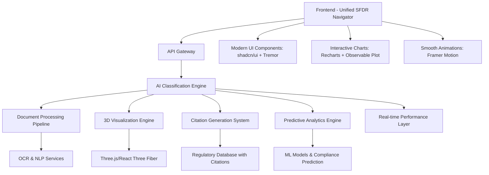
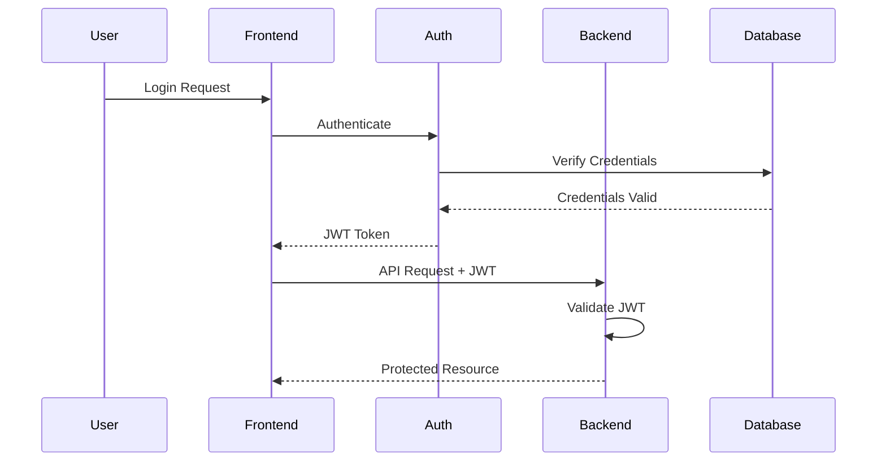
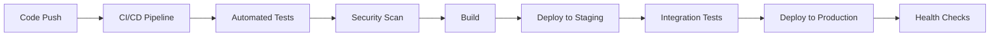

# Synapses GRC Platform Architecture Overview

## System Architecture

### High-Level Architecture



### Core Components

#### 1. Frontend Architecture
- **Framework**: React 18 with TypeScript
- **State Management**: TanStack Query
- **UI Components**: shadcn/ui + Tremor
- **Visualizations**: Recharts + Observable Plot + React Three Fiber
- **Animations**: Framer Motion
- **Forms**: React Hook Form
- **Authentication**: Supabase Auth

#### 2. Backend Architecture
- **Runtime**: FastAPI with Python 3.12
- **AI Framework**: OpenRouter integration
- **Primary AI Model**: Qwen3_235B_A22B
- **Database**: Supabase (PostgreSQL)
- **Document Processing**: AI-powered OCR & NLP

#### 3. Infrastructure
- **Cloud Provider**: Vercel (Frontend), AWS/Azure (Backend)
- **CI/CD**: GitHub Actions
- **Monitoring**: OpenTelemetry + Sentry
- **Security**: Enterprise-grade authentication and monitoring

## Security Architecture

### Authentication Flow


### Security Measures
1. Multi-factor authentication
2. Role-based access control
3. JWT token management
4. API security (rate limiting, validation)
5. Data encryption (at rest and in transit)

## Data Architecture

### Core Data Models

```typescript
// Fund Profile Data Model
interface FundProfile {
  fundType: 'UCITS' | 'AIF' | 'MMF' | 'PEPP' | 'IORP' | 'OTHER';
  fundName: string;
  isin?: string;
  lei?: string;
  targetArticleClassification: 'Article6' | 'Article8' | 'Article9';
  investmentObjective?: string;
  sustainabilityCharacteristics?: string[];
  investmentStrategy?: string;
  benchmarkInfo?: BenchmarkInfo;
}

// Classification Result
interface ClassificationResult {
  recommendedArticle: 'Article6' | 'Article8' | 'Article9';
  confidence: number;
  reasoning: string[];
  alternativeClassifications?: AlternativeClassification[];
  complianceScore: number;
  validationDetails: ValidationDetails;
}
```

### Database Schema
- PostgreSQL with row-level security
- Supabase for real-time capabilities
- Automated backups and replication

## Integration Architecture

### External Systems
1. Regulatory Data Sources
   - ESMA
   - National Regulators
   - Legal Databases

2. Technology Partners
   - Cloud Infrastructure
   - AI/ML Services
   - Security Services
   - Monitoring Services

### API Architecture
- RESTful API design
- OpenAPI 3.0 specification
- Rate limiting and security
- Comprehensive documentation

## Performance Architecture

### Performance Targets
| Metric | Target | Current |
|--------|---------|---------|
| Page Load Time | <2s | 2.5s |
| API Response | <500ms | 100ms |
| Classification | <30s | 15s |
| Document Processing | <60s | 45s |
| Uptime | 99.9% | 95% |

### Optimization Strategies
1. CDN integration
2. Caching layers
3. Database optimization
4. Load balancing
5. Auto-scaling

## Monitoring Architecture

### Key Metrics
1. System Performance
   - Response times
   - Error rates
   - Resource utilization

2. Business Metrics
   - User engagement
   - Classification accuracy
   - Processing volumes

3. Security Metrics
   - Authentication attempts
   - API usage patterns
   - Security events

### Alerting System
- Real-time alerts
- Severity-based routing
- Incident management
- Performance degradation detection

## Deployment Architecture

### Environments
1. Development
2. Staging
3. Production
4. DR (Disaster Recovery)

### Deployment Process


## Future Architecture Considerations

### Planned Enhancements
1. Multi-tenant architecture
2. Advanced analytics engine
3. Machine learning pipeline
4. Global deployment
5. Enhanced security features

### Technology Roadmap
1. Microservices migration
2. Kubernetes adoption
3. Advanced monitoring
4. AI/ML improvements
5. Security enhancements

## Architecture Decision Records

See the [decisions](./decisions/) directory for detailed architecture decision records (ADRs) documenting significant architectural decisions.
